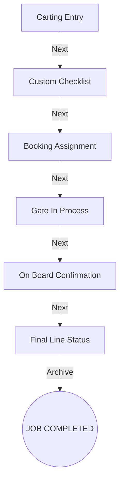

# Dock Export Process - Oman Cargo Mover

This directory contains the operational workflow for **Dock Stuffing** and **Export Job Management**. The flow consists of 6 integrated stages, each contributing to the complete lifecycle of an export job from cargo arrival to vessel departure.

## Page Flow Diagram

## Stage Descriptions

### 1. Carting (`carting.html`)
- **Stage 1: Arrival & Unloading**
- **Purpose**: Tracks the initial arrival of cargo from the client/transporter.
- **Key Actions**: Record truck details, cargo weight, and unloading status.

### 2. Checklist (`custom-checklist.html`)
- **Stage 2: Operational Inspection**
- **Purpose**: Detailed terminal inspection based on custom or standard requirements.
- **Key Actions**: Verify cargo condition, dimensions, and type before proceeding to booking.

### 3. Booking (`booking.html`)
- **Stage 3: Slot & Shipping Line Assignment**
- **Purpose**: Assigning the cargo to a specific vessel and shipping line.
- **Key Actions**: 
    - Assign Shipping Line and Vessel Name.
    - Set Booking Reference Number.
    - Select Payment Method (Paid By Party/Self).
    - **Dynamic Container Mapping**: Assign cargo to specific container numbers, including seal, truck, and weight details.

### 4. Gate In (`gate-in.html`)
- **Stage 4: Port Entry Verification**
- **Purpose**: Tracking the entry of containers into the CFS (Container Freight Station) or Port Terminal.
- **Key Actions**: 
    - Record Gate Pass Numbers.
    - Inspector verification and timestamping.
    - Real-time status tracking (Pending, Gate In, Gate Out).

### 5. On Board (`on-board.html`)
- **Stage 5: Vessel Departure Confirmation**
- **Purpose**: Confirms that the containers have successfully been loaded onto the vessel.
- **Key Actions**: 
    - Record Onboard Date and Time.
    - Input Bill of Lading (BL) Number.
    - Upload final BL Documentation.
    - **Draft Capability**: Save progress without closing the job immediately.

### 6. Line Process (`line.html`)
- **Stage 6: Final Reconciliation**
- **Purpose**: Post-operation verification and archiving.
- **Key Actions**: Final manifest verification before job archival.

---

## Data Integration
- **Local Storage**: Data is persisted in `localStorage` under `omancargo_jobs`.
- **Navigation**: Pages are linked via URL parameters (`?id=[JOB_ID]`) to ensure seamless transitions between stages.
- **Stepper**: A standardized 6-step progress bar is shared across all pages for consistent UI/UX.
